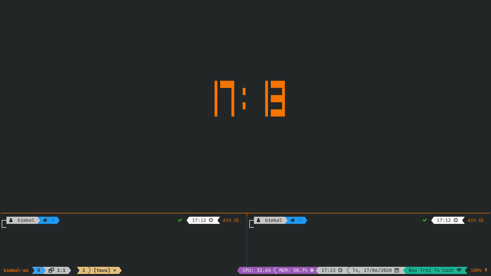

# Tmux Ultimate theme

A dark theme for [tmux](https://github.com/tmux/tmux/wiki)'s status bar.

## Table of Contents

1. [Introduction](#introduction)
2. [List OS support](#list-os-support)
3. [Requirements](#requirements)
4. [Installation](#installation)
    - [Install with Tmux Plugin Manager](#install-with-tmux-plugin-manager-recommended)
    - [Manual Installation](#manual-installation)
5. [Configuration](#configuration)
    - [Color](#color)
    - [Optional](#optional)
    - [Format information](#format-information)
    - [Icon](#icon)
6. [Known Issues](#known-issues)

## Introduction



This theme is based on some features of [Dracula's tmux theme](https://github.com/dracula/tmux) and inspried by many themes such as: [Oh My Tmux!](https://github.com/gpakosz/.tmux), [tmux-themepack](https://github.com/jimeh/tmux-themepack).

## List OS support

| **Feature**                                                                    |     **Linux**      |  **BSD variants**  |      **Mac**       | **Window's <br> Cygwin, MinGW, MSYS** |
| ------------------------------------------------------------------------------ | :----------------: | :----------------: | :----------------: | :-----------------------------------: |
| Show [Powerline symbols](https://github.com/ryanoasis/powerline-extra-symbols) | :heavy_check_mark: | :heavy_check_mark: | :heavy_check_mark: |          :heavy_check_mark:           |
| Show prefix whenever press                                                     | :heavy_check_mark: | :heavy_check_mark: | :heavy_check_mark: |          :heavy_check_mark:           |
| CPU & Memory usage info                                                        | :heavy_check_mark: | :heavy_check_mark: | :x: |          :x:           |
| Date & Time                                                                    | :heavy_check_mark: | :heavy_check_mark: | :heavy_check_mark: |          :heavy_check_mark:           |
| Network's IPv4 address                                                         | :heavy_check_mark: | :heavy_check_mark: | :heavy_check_mark: |          :x:           |
| Network's SSID                                                                 | :heavy_check_mark: | :heavy_check_mark: | :heavy_check_mark: |          :x:           |
| Battery                                                                        | :heavy_check_mark: | :heavy_check_mark: | :heavy_check_mark: |          :x:           |

## Requirements

- **Tmux** **_version 2.5+_**, running inside **Linux**, **BSD** variants, **Mac** or **Windows** (via _Cygwin_, _MinGW_, _MSYS_).
- For **Linux** & **BSD** variants:

  - `bash`, `cut`, `tr`, `grep`, `sed`, `awk`, `jq`: Essentials.
  - `sysstat` _(`mpstat` command)_, `procps` _(`free` command)_: For [CPU & Memory usage info](#list-os-support).
  - `iw`: For [Network's SSID](#list-os-support).
  - `ip`: For [Network's IPv4 address](#list-os-support).
  - `acpi`: For [Battery info](#list-os-support).

  > All these packages should have already been installed by default on your distro. You can check for each one by running command `$ command -v <name of package>`

- For **Mac**:

  - `bash`, `cut`, `tr`, `grep`, `sed`: Essentials.
  - `ip`: For [Network's IPv4 address](#list-os-support).
  - `pmset`: For [Battery info](#list-os-support).

  > All these packages should have already been installed by default on Mac. You can check for each one by running command `$ command -v <name of package>`

- [**Nerd Font**](https://github.com/ryanoasis/nerd-fonts) (mine is [**_JetBrainsMono Nerd Font_**](https://github.com/ryanoasis/nerd-fonts/tree/master/patched-fonts/FiraCode)).
- A **Terminal** that supports _True color_ (mine is [**_Alacritty_**](https://github.com/alacritty/alacritty)).
  > Remember to [turn on True color support inside **Tmux**](https://bruinsslot.jp/post/how-to-enable-true-color-for-neovim-tmux-and-gnome-terminal/)

## Installation

> Only choose 1 method.

### Install with [Tmux Plugin Manager](https://github.com/tmux-plugins/tpm) (recommended)

- Add plugin to the list of TPM plugins in your `.tmux.conf`:

    ```shell
    set -g @plugin 'cuongvuong-phoenix/tmux-ultimate-theme'
    ```

- Reload your `.tmux.conf`:

    ```shell
    tmux source <path to your .tmux.conf file>
    ```

- Install the plugin by pressing `prefix + I` when inside of _Tmux_.

### Manual Installation

- Clone the repo:

    ```shell
    git clone https://github.com/cuongvuong-phoenix/tmux-ultimate-theme.git <your path>
    ```

- Add this line to the bottom of your `.tmux.conf`:

    ```shell
    run-shell <your path>/tmux-ultimate-theme.tmux
    ```

- Reload your `.tmux.conf`:

    ```shell
    tmux source <path to your .tmux.conf file>
    ```

## Configuration

You can customize to your needs by changing these options in `.tmux.conf`:

```shell
set -g <option's name> <new value>
```

### Color

> <u>_Note_</u>: Make sure color's value is always **lower case** or tmux won't understand your color.

| **Option's name**                 | **Description**                      | **Default value** |
| --------------------------------- | ------------------------------------ | :---------------: |
| `@ultimate-theme-color-black`     | Set your favourite `BLACK` color     |     `#232627`     |
| `@ultimate-theme-color-white`     | Set your favourite `WHITE` color     |     `#fcfcfc`     |
| `@ultimate-theme-color-red`       | Set your favourite `RED` color       |     `#ed1515`     |
| `@ultimate-theme-color-green`     | Set your favourite `GREEN` color     |     `#11d418`     |
| `@ultimate-theme-color-yellow`    | Set your favourite `YELLOW` color    |     `#e5c07b`     |
| `@ultimate-theme-color-orange`    | Set your favourite `ORANGE` color    |     `#f67400`     |
| `@ultimate-theme-color-blue`      | Set your favourite `BLUE` color      |     `#45a1ed`     |
| `@ultimate-theme-color-magenta`   | Set your favourite `MAGENTA` color   |     `#9b59b6`     |
| `@ultimate-theme-color-pink`      | Set your favourite `PINK` color      |     `#ff79c6`     |
| `@ultimate-theme-color-cyan`      | Set your favourite `CYAN` color      |     `#18b495`     |
| `@ultimate-theme-color-grey`      | Set your favourite `GREY` color      |     `#c1c4c3`     |
| `@ultimate-theme-color-dark-grey` | Set your favourite `DARK_GREY` color |     `#3e4452`     |

### Optional

| **Option's name**                         | **Description**                                                         | **Default value** |
| ----------------------------------------- | ----------------------------------------------------------------------- | :---------------: |
| `@ultimate-theme-show-powerline`          | Choose to show [Powerline symbols](#list-os-support) or not       |      `true`       |
| `@ultimate-theme-show-prefix`             | Choose to show [Prefix](#list-os-support) or not                  |      `true`       |
| `@ultimate-theme-show-cpu-mem`            | Choose to show [CPU & Memory usage info](#list-os-support) or not |      `true`       |
| `@ultimate-theme-show-date-time`          | Choose to show [Date & Time](#list-os-support) or not             |      `true`       |
| `@ultimate-theme-show-network-ip-address` | Choose to show [Network's IPv4 address](#list-os-support) or not  |      `true`       |
| `@ultimate-theme-show-network-id`         | Choose to show [Network's SSID](#list-os-support) or not          |      `true`       |
| `@ultimate-theme-show-battery`            | Choose to show [Battery info](#list-os-support) or not            |      `true`       |

### Format information

| **Option's name**             | **Description**                                                    | **Default value** |
| ----------------------------- | ------------------------------------------------------------------ | :---------------: |
| `@ultimate-theme-format-time` | Set format for **Time** based on [strftime](http://www.strfti.me/) |      `%H:%M`      |
| `@ultimate-theme-format-date` | Set format for **Date** based on [strftime](http://www.strfti.me/) |  `%a, %e/%m/%Y`   |

### Icon

| **Option's name**                            | **Description**                                                                            | **Default value** |
| -------------------------------------------- | ------------------------------------------------------------------------------------------ | :---------------: |
| `@ultimate-theme-icon-powerline-left`        | Set **Powerline's icon** for **_left side of status bar_**                                 |  `` or `\uE0B0`  |
| `@ultimate-theme-icon-powerline-left-thin`   | Set **Powerline's thin icon** for **_left side of status bar_**                            |  `` or `\uE0B1`  |
| `@ultimate-theme-icon-powerline-right`       | Set **Powerline's icon** for **_right side of status bar_**                                |  `` or `\uE0B2`  |
| `@ultimate-theme-icon-powerline-right-thin`  | Set **Powerline's thin icon** for **_right side of status bar_**                           |  `` or `\uE0B3`  |
| `@ultimate-theme-icon-window-pane`           | Set icon of **Window : Pane**                                                              |  `` or `\uF2D2`  |
| `@ultimate-theme-icon-prefix`                | Set your favourite **Prefix** icon                                                         |  `` or `\uF73F`  |
| `@ultimate-theme-icon-cpu-mem`               | Set icon of **CPU & Memory usage info**                                                    |  `` or `\uF85A`  |
| `@ultimate-theme-icon-time`                  | Set icon of **Time**                                                                       |  `` or `\uF017`  |
| `@ultimate-theme-icon-date`                  | Set icon of **Date**                                                                       |  `` or `\uF073`  |
| `@ultimate-theme-icon-network-offline`       | Set icon of **Network** when in **_Offline_** mode                                         |  `` or `\uF65A`  |
| `@ultimate-theme-icon-network-ethernet`      | Set icon of **Network** when in **_Ethernet_** mode                                        |  `ﯱ` or `\uFBF1`  |
| `@ultimate-theme-icon-network-wifi`          | Set icon of **Network** when in **_Wifi_** mode                                            |  `` or `\uF1EB`  |
| `@ultimate-theme-icon-battery-ac`            | Set icon of **Battery** when in **_AC_** mode                                              |  `` or `\uF0E7`  |
| `@ultimate-theme-icon-battery-discharging-4` | Set icon of **Battery** when in **_DC_** mode & remaining percentage in range `76% → 100%` |  `` or `\uF240`  |
| `@ultimate-theme-icon-battery-discharging-3` | Set icon of **Battery** when in **_DC_** mode & remaining percentage in range `51% → 75%`  |  `` or `\uF241`  |
| `@ultimate-theme-icon-battery-discharging-2` | Set icon of **Battery** when in **_DC_** mode & remaining percentage in range `26% → 50%`  |  `` or `\uF242`  |
| `@ultimate-theme-icon-battery-discharging-1` | Set icon of **Battery** when in **_DC_** mode & remaining percentage in range `6% → 25%`   |  `` or `\uF243`  |
| `@ultimate-theme-icon-battery-discharging-0` | Set icon of **Battery** when in **_DC_** mode & remaining percentage in range `0% → 5%`    |  `` or `\uF244`  |

## Known Issues

Feel free to open [Issues](https://github.com/cuongvuong-phoenix/tmux-ultimate-theme/issues) when you have any trouble with the plugin or you just want to request new features.
